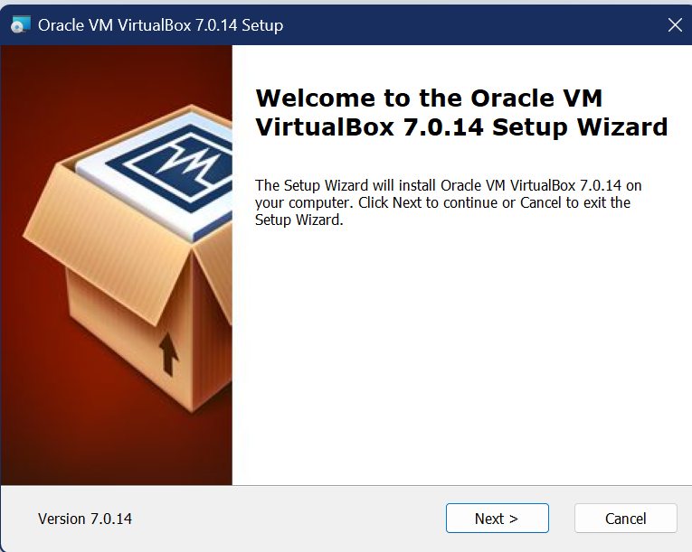
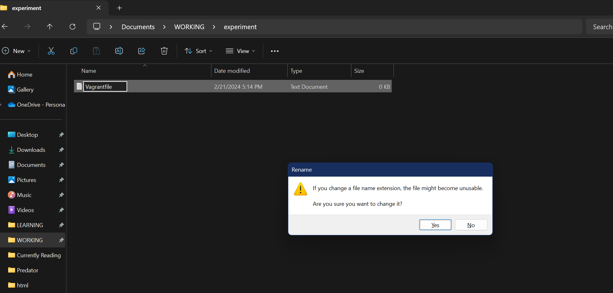

# Quick setup virtual machine using Vagrant and Virtualbox

## Overview
A long time ago when you want to learn linux you have to install one of the Linux distributions in your machine. It takes time booting an ISO file in a USB or disk, then plug in into your machine, then reboot, then config bla bla bla,... It could take up to hours and even longer when the installation has issues, also when you are about to use it, you must restart your computer and then go to the boot menu and then choose Linux. I am not talking about the case that you are rich and has multiple working computer. <br>
Then virtual machine comes out and you can run any Linux distribution in your own machine, regardless of what OS your machine runs on. But the installation process still takes time, you still have to boot ISO, but this time you boot it on a virtual disk, then do all else in the virtual machine created by a software like Virtualbox or VMware. <br>
Developers are lazy, instead of doing these by hand, they are always trying to automate these processes, and so that Vagrant comes out to make installation easier and reusable.

## Benefit of using Vagrant and any other Infrastructure as Code tool
- You can use `code` to setup your virtual machine, even multiple virtual machines at a time.
- If your code has errors, the installation fails, then you just need to fix the code and run it again. You don't need to redo the whole installation process.
- You only need to code once. Then whenever you need the VM, just run a command to make it live. And each time you run it, the created VM will be the same, even installed software, services, ... as long as you've configured it before.

## Prequesities
The instruction is created and testing in a Windows machine, using Windows 11. But both Virtualbox and Vagrant supports x86/64 machine that runs on Windows, Linux-based OS and MacOS. If your machine has Intel or AMD chip, then it is a x64/86 (and also be called AMD64). If you have a machine with Apple Silicon chip (which is not x86/64 but ARM), then you need to find another VM software, such as qemu or VMWare. 

## Install required tools
### Install Virtualbox
Open this page https://www.virtualbox.org/wiki/Downloads.


Find proper download link based on your machine. For example if you machine runs on Windows, click on Windows host green text to download the installer. <br>
Then open the downloaded file.

Follow the instruction on the install windows. <br>
And then you've done with virtual box.
### Install Vagrant

Same as Virtualbox, go to the official download page of Vagrant: https://developer.hashicorp.com/vagrant/install?product_intent=vagrant

Then find your proper version:

The AMD64 is the x86/64 I mentioned before. If you are using a machine using Intel/AMD CPU, then it's a x86/64 or AMD64 machine.
<br>
After done the installation stuff, go check if vagrant is properly installed. Open terminal (Search for Terminal or powershell or command prompt if you are using Windows), then type the command:
```
vagrant -v
```
If vagrant is successfully installed, then the version will appear.


Then you've done with the installation, now take a look at how to use it.

### Create a vagrant file

Create an empty folder. I will make it an example name "experiment"

Remember to enable View file extensions.


This because we will create a text file named "Vagrantfile", without any extensions. The file is required because vagrant reads data only from file with the name Vagrantfile.
If this prompt appear, click Yes


Then right-click into file Vagrantfile and click on Edit with nodepad.

Copy all line above and paste it into the Vagrantfile
```ruby
# -*- mode: ruby -*-
# vi: set ft=ruby :

# All Vagrant configuration is done below. The "2" in Vagrant.configure
# configures the configuration version (we support older styles for
# backwards compatibility). Please don't change it unless you know what
# you're doing.
Vagrant.configure("2") do |config|
  # The most common configuration options are documented and commented below.
  # For a complete reference, please see the online documentation at
  # https://docs.vagrantup.com.

  # Every Vagrant development environment requires a box. You can search for
  # boxes at https://vagrantcloud.com/search.
  config.vm.box = "gusztavvargadr/ubuntu-desktop-2004-lts"

  # Disable automatic box update checking. If you disable this, then
  # boxes will only be checked for updates when the user runs
  # `vagrant box outdated`. This is not recommended.
  # config.vm.box_check_update = false

  # Create a forwarded port mapping which allows access to a specific port
  # within the machine from a port on the host machine. In the example below,
  # accessing "localhost:8080" will access port 80 on the guest machine.
  # NOTE: This will enable public access to the opened port
  # config.vm.network "forwarded_port", guest: 80, host: 8080

  # Create a forwarded port mapping which allows access to a specific port
  # within the machine from a port on the host machine and only allow access
  # via 127.0.0.1 to disable public access
  # config.vm.network "forwarded_port", guest: 80, host: 8080, host_ip: "127.0.0.1"

  # Create a private network, which allows host-only access to the machine
  # using a specific IP.
  # config.vm.network "private_network", ip: "192.168.33.10"

  # Create a public network, which generally matched to bridged network.
  # Bridged networks make the machine appear as another physical device on
  # your network.
  # config.vm.network "public_network"

  # Share an additional folder to the guest VM. The first argument is
  # the path on the host to the actual folder. The second argument is
  # the path on the guest to mount the folder. And the optional third
  # argument is a set of non-required options.
  # config.vm.synced_folder "../data", "/vagrant_data"

  # Disable the default share of the current code directory. Doing this
  # provides improved isolation between the vagrant box and your host
  # by making sure your Vagrantfile isn't accessable to the vagrant box.
  # If you use this you may want to enable additional shared subfolders as
  # shown above.
  # config.vm.synced_folder ".", "/vagrant", disabled: true

  # Provider-specific configuration so you can fine-tune various
  # backing providers for Vagrant. These expose provider-specific options.
  # Example for VirtualBox:
  #
  config.vm.provider "virtualbox" do |vb|
  #   # Display the VirtualBox GUI when booting the machine
    vb.gui = true
  #
  #   # Customize the amount of memory on the VM:
    vb.memory = "4096"
    # I don't know why but there is a bug hang the vm booting if not limit to 1 cpu
    vb.cpus = "1"
  end
  #
  # View the documentation for the provider you are using for more
  # information on available options.

  # Enable provisioning with a shell script. Additional provisioners such as
  # Ansible, Chef, Docker, Puppet and Salt are also available. Please see the
  # documentation for more information about their specific syntax and use.
  # config.vm.provision "shell", inline: <<-SHELL
  #   apt-get update
  #   apt-get install -y apache2
  # SHELL
end
```

Now open the folder using terminal and run the command: <br>
`vagrant up`


Waiting for the VM to be created.
And the VM has been created, enjoy.


If you want to shut down the VM, run `vagrant halt` on the same folder you created.

You can access and use the virtual machine using terminal in Windows terminal if you do not want to use the graphic interface of the virtual machine. To do so, open terminal on the folder has your Vagrantfile, then run the command
`vagrant ssh`


You are inside the terminal of the virtual machine now, now practice some Linux commands and enjoy.


If you do not want to have graphic user interface at all, instead of pasting the above Vagrantfile code, paste the file in [this file](server-ubuntu-2004/Vagrantfile).

All the Vagrantfiles I created are in this GitHub repository, feel free to explore them as I will update them often.